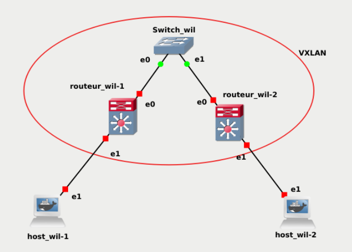

# Part 2: Discovering a VXLAN

> Goal: setup a VXLAN network, first in static and then in dynamic multicast.

## Table of content
- [Diagram](#diagram)
- [Definitions](#definitions)
	- [VXLAN](#vxlan)
	- [VTEP](#vtep)
	- [Bridge](#bridge)
- [Configurations](#configurations)

## Diagram



## Definitions

> In this part we will shortly present the new software, technologies and protocols.

### VXLAN

Virtual Extended Local Area Network is a **network virtualization** technology that **encapsulates** layer 2 Ethernet frames within layer 4 UDP datagrams.<br>In other words, a local network is simulated between non-local networks by creating an Ethernet packet, encapsulated in an UDP packet sent over the non-local area (example: the Internet). Once received the packet is decapsulated and transmitted to the local aread as a regular Ethernet packet.

### VTEP

VTEPs (VXLAN Tunnel End Point) is a network device or software component that **encapsulates or decapsulates VXLAN packets**.

### VNI
VNIs (VXLAN Network Identifier) identifies the VXLAN groups in a dynamic multicast structure. Only VTEPs from the same VNI will receives the packets from one another.

### Bridge

A bridge interface is a virtual switch inside a device that **connects multiple network interfaces** so they can communicate as if they were on the same physical network.<br>
> In our diagram we can see that our routers are connect to the switch and hosts by differents interfaces. The bridge connects them so the flow can pass from one to another.

## Configurations

### Routers
```sh
# Bridge interface br0
	# create a bridge br0
ip link add br0 type bridge
	# up the bridge
ip link set dev br0 up
	# create the vxlan (id:10)
ip link add name vxlan10 type vxlan id 10 dstport 4789

# Ethernet interface eth1 as a bridge port
# Ethernet interface eth1
	# Up eht1
ip link set dev eth1 up
	# add eth1 to the bridge
brctl addif br0 eth1

# VXLAN interface vxlan10
	# create the static interface vxlan with id 10, on interface eth0, part of group 239.1.1.1 on port 4789
	# Static because IP addresses of routers from network are hard written
ip link add name vxlan10 type vxlan id 10 dev eth0 remote 10.1.1.2 local 10.1.1.1 dstport 4789
	# create the dynamic interface vxlan with id 10, on interface eth0, part of group 239.1.1.1 on port 4789
	# Dynamic because of the group (VNI)
ip link add name vxlan10 type vxlan id 10 dev eth0 group 239.1.1.1 dstport 4789
	# up the interface vxlan10
ip link set vxlan10 up
	# add vxlan10 to the bridge
brctl addif br0 vxlan10
```