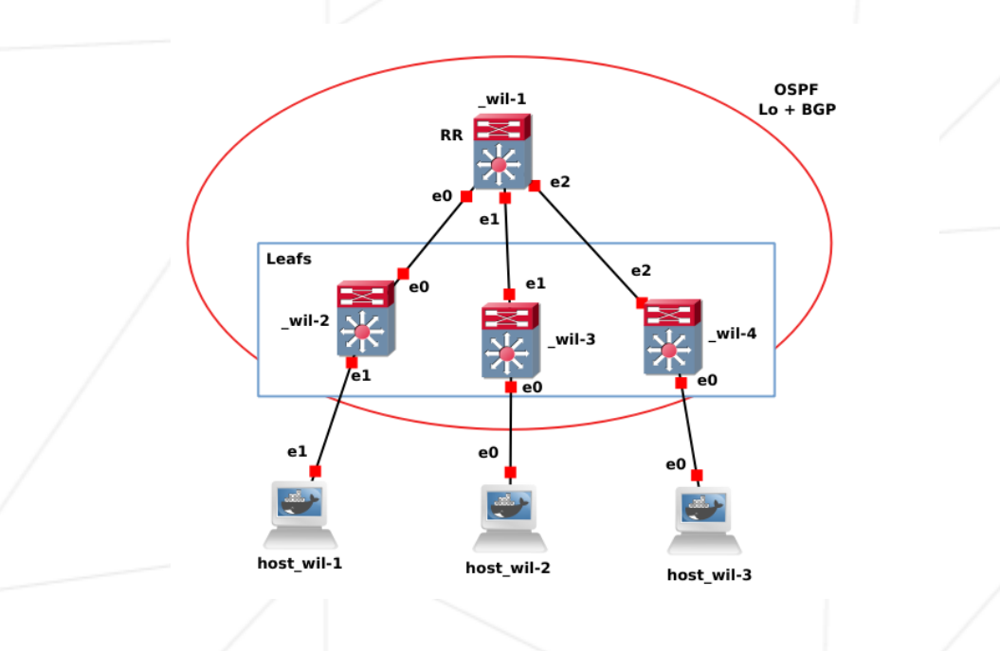

# Part 3: Discovering BGP with EVPN

For this exercise, we had to implement BGP EVPN (RFC 7432) without MPLS, using a VXLAN with ID 10, as seen in the previous part. The goal was to configure a small datacenter network where the controller learns MAC addresses dynamically.

### Table of content

- [Diagram](#diagram)
- [Resolution](#resolution)
- [Print Configuration Cmd](#print-configuration-cmd)
- [Configurations](#configurations)
	- [Router 1](#routers-1)
	- [Routers 2-3-4](#routers-2-3-4)
	- [Hosts](#hosts)

## Diagram



## Resolution

In this exercise, we were required to implement two new protocols to ensure our network operates correctly: the **BGP EVPN** protocol and the **OSPF** protocol.

The BGP EVPN protocol (overlay) is used to identify hosts in our network efficiently, eliminating the need to broadcast ARP requests throughout the entire network. To achieve this, we needed to:

- Define a Route Reflector (RR), a router that orchestrates other routers (BGP peers) and transmits information (wil-1).
  - The RR sets up a BGP server and allows BGP peers to connect to it. When the RR receives information (such as a new host in the network), it retransmits this information to all connected BGP peers.
  - This setup facilitates the addition of new machines to the network, as they only need to connect to the RR to access all necessary information.

- Define BGP peers, clients that connect to the RR and share information related to their network (IP and MAC addresses of connected machines).

> For example, when host-wil-1 connects to the network, wil-2 reports to wil-1 that a machine has connected to its network, specifying its IP and MAC addresses. This information is then relayed to routers wil-3 and wil-4. If host 2 attempts to communicate and requests the MAC address of host 1, router wil-3 can respond without querying the entire network.

The OSPF protocol serves as the physical link in the network (underlay). This link-state routing protocol uses an algorithm to determine routes. Routers collect link cost information and construct a tree of all possible paths from their perspective. The best routes are then integrated into the routing table. To configure it, we needed to:

- Have router wil-1 define an area (here, area 0) where all interfaces with an IP address announce their routes.
- Ensure other routers (2-3-4) activate OSPF.

Once everything is configured and the VXLAN is set up, the machines should be able to communicate. Here's an example of communication:

> Host 1 attempts to ping host 3. Host 1 asks its router (wil-2) for host 3's location; its router directly provides host 3's MAC address (wil-2 knows host 3's address thanks to the BGP EVPN protocol). Host 1 then sends an ICMP packet (ping) to host 3. Upon reaching router wil-2's eth1 interface, it is bridged to the VXLAN. The VTEP encapsulates the data into an IP + UDP packet, and OSPF assists in routing the data to the destination VTEP (wil-4) since it knows the route. Upon arrival at wil-4, the VTEP decapsulates the data and sends it to host-3, without host-3 realizing the packet originated from another subnet. 


## Print Configuration Cmd

```sh
vtysh
conf t

# bgp
do sh bgp summary
do sh bgp l2vpn evpn
do sh bgp neighbor

# ospf
do sh ip route
do sh ip ospf int
do sh ip ospf neighbork
```

## Configurations

### Routers 1

```sh
##### Network interface Config:
##### The goal here is to define all interface for differents subnets (wil-2 / wil-3 / wil-4)

# Loopback interface
auto lo
iface lo inet loopback
	address 1.1.1.1
	netmask 255.255.255.255

# Ethernet interface eth0 with a static IP
auto eth0
iface eth0 inet static
	address 30.1.1.1
	netmask 255.255.255.252 #/30
	broadcast 30.1.1.3

# Ethernet interface eth1 with a static IP
auto eth1
iface eth1 inet static
	address 30.1.1.5
	netmask 255.255.255.252 #/30
	broadcast 30.1.1.3

# Ethernet interface eth2 with a static IP
auto eth2
iface eth2 inet static
	address 30.1.1.9
	netmask 255.255.255.252 #/30
	broadcast 30.1.1.3

##### Configure OSPF and BGP with VTYSH

router bgp 1
	# peer group configuration
	neighbor ibgp peer-group
	# define AS
	neighbor ibgp remote-as 1
	# establish loop back for bgp sessions
	neighbor ibgp update-source lo
	# listen connections from a range
	bgp listen range 1.1.1.0/29 peer-group ibgp

	address-family l2vpn evpn
		# active EVPN (mac addr/ ip transport)
		neighbor ibgp activate
		# define neighbor as RR client
		neighbor ibgp route-reflector-client
exit-address-family

router ospf
	# Active OSPF on all interfaces (share route with other OSPF routers)
	network 0.0.0.0/0 area 0
```

### Routers 2-3-4

:warning: interface names are subject to change between routers

```sh
# Define interfaces
# Loopback interface
auto lo
iface lo inet loopback
	address 1.1.1.2
	netmask 255.255.255.255

# Ethernet interface eth0 with a static IP
auto eth0
iface eth0 inet static
	address 30.1.1.2
	netmask 255.255.255.252 #/30
	broadcast 30.1.1.3

# create a bridge br0
ip link add br0 type bridge
# up the bridge
ip link set dev br0 up
# create the vxlan (id:10)
ip link add name vxlan10 type vxlan id 10 dstport 4789
# up vxlan
ip link set vxlan10 up
# make a bridge between host and vxlan
brctl addif br0 eth1
brctl addif br0 vxlan10

#### VTYSH conf
router bgp 1
	# Enables BGP on this router with Autonomous System (AS) number 1.
	# Defines a BGP neighbor with IP 1.1.1.1 (wil-1)
	neighbor 1.1.1.1 remote-as 1
	# Specifies that the loopback interface should be used as the source IP for BGP updates.
	neighbor 1.1.1.1 update-source lo

	address-family l2vpn evpn
		# Enables EVPN route exchange with neighbor 1.1.1.1.
		neighbor 1.1.1.1 activate
		# Advertises all VXLAN VNI (Virtual Network Identifiers) learned by the router to the BGP neighbor.	
		advertise-all-vni
 exit-address-family

# Enable OSPF
router ospf
```

### Hosts

:warning: interface names are subject to change between routers

```sh
# Define interfaces
auto lo
iface lo inet loopback

auto eth1
iface eth1 inet static
    address 192.168.1.1
    netmask 255.255.255.0
```